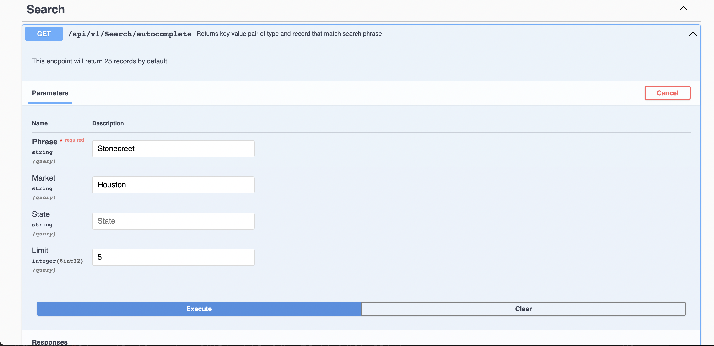

###Autocomplete Endpoint using ElasticSearch

*Returns a list of properties and management company that matches phrase text*


#####Requirements
- [x] AWS Open Search / Elastic Search
- [x] .Net 6


Start application with `dotnet run` application will startup on a swagger page that can be used for testing. The endpoint `api/v1/search/autocomplete` 


Expected Query Inputs

phrase*
: phrase is required as the search term

limit
: Limit determines maximum number of items to return, the default is 25

Market
: This allows you scope your search a particular market/region

State
: This allows you scope your search a particular state



**Sample curl Request for endpoint**
```
curl -X 'GET' \
  'https://localhost:7171/api/v1/Search/autocomplete?Phrase=Stonecreet&Market=Houston&Limit=5' \
  -H 'accept: application/json'
 ```

This tells the app to look for top 5 closest match of stonecreet within properties and management company.

```
{
  "data": [
    {
      "property": {
        "type": "property",
        "id": "74614",
        "name": "Stonecreek",
        "formerName": "",
        "market": "Houston",
        "state": "TX"
      }
    },
    {
      "property": {
        "type": "property",
        "id": "73561",
        "name": "Stonecrossing East",
        "formerName": "The Pathway",
        "market": "Houston",
        "state": "TX"
      }
    },
    {
      "property": {
        "type": "property",
        "id": "74616",
        "name": "Stonecrossing of Westchase",
        "formerName": "",
        "market": "Houston",
        "state": "TX"
      }
    },
    {
      "property": {
        "type": "property",
        "id": "75086",
        "name": "Stone Creek at Old Farm",
        "formerName": "Alexan at Old Farm",
        "market": "Houston",
        "state": "TX"
      }
    },
    {
      "property": {
        "type": "property",
        "id": "71418",
        "name": "Creekstone",
        "formerName": "",
        "market": "Houston",
        "state": "TX"
      }
    }
  ],
  "message": "Autocomplete Success",
  "statusCode": "00"
}
```

Thank you 😄!